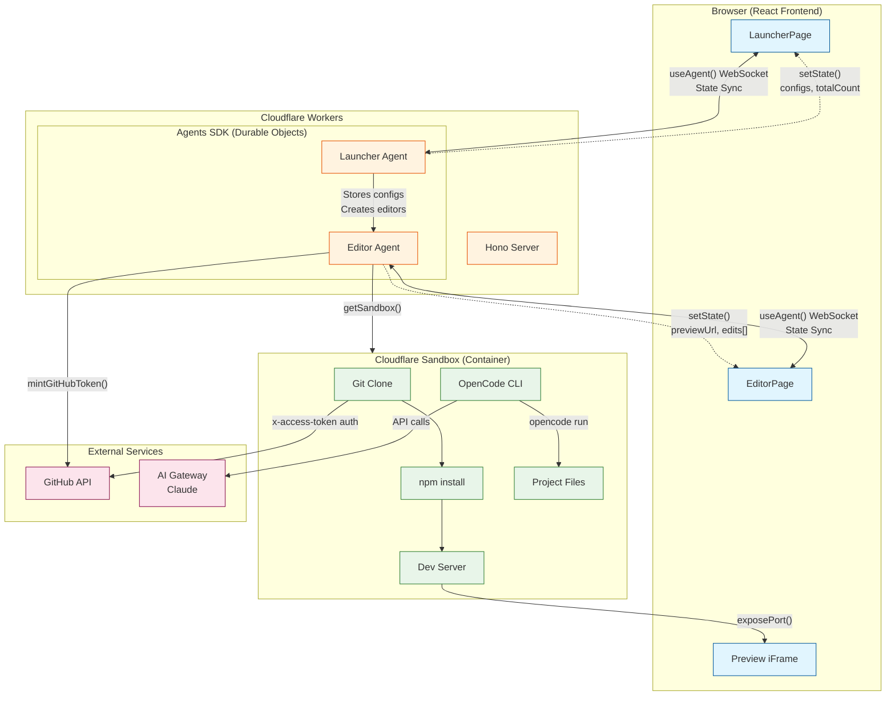
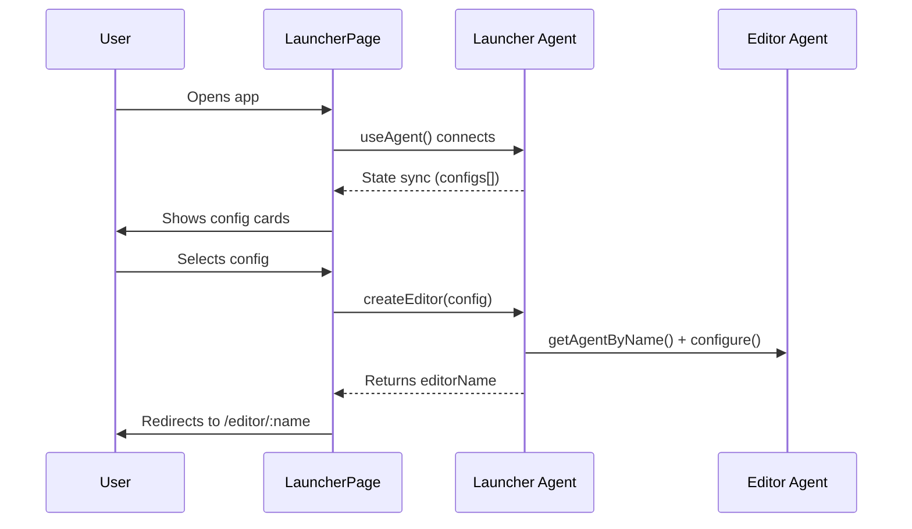
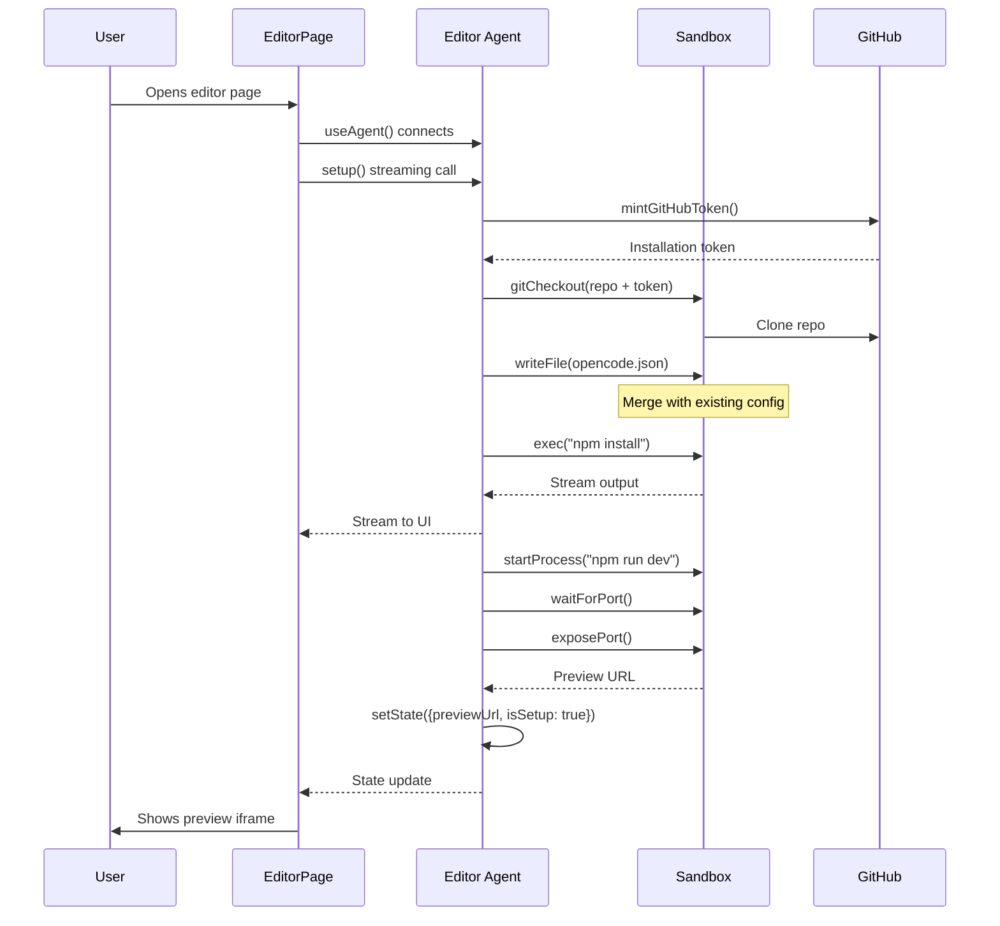
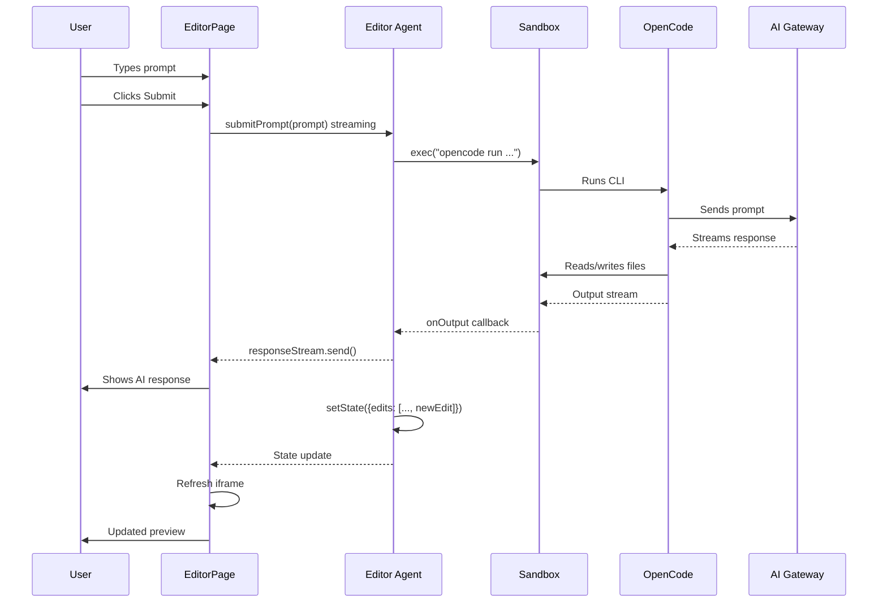

# Bureaucreasy Editor

A full-stack AI-powered document editing application built with React, Cloudflare Workers, the Agents SDK, and Cloudflare Sandbox. Features real-time state synchronization and containerized preview environments.

## Architecture



## Data Flow

### 1. Launcher Phase



### 2. Editor Setup Phase



### 3. Edit Phase



## State Management

### Launcher Agent State

```typescript
type LauncherState = {
  hostname: string;           // Current hostname
  totalCount: number;         // Total edits across all editors
  configurations: Config[];   // Available project configs
};
```

### Editor Agent State

```typescript
type EditorState = {
  hostname?: string;          // Deployment hostname
  displayName?: string;       // Human-readable name
  githubOwner?: string;       // GitHub org/user
  githubRepo?: string;        // Repository name
  siteUrl?: string;           // Production site URL
  previewUrl?: string;        // Sandbox preview URL
  previewPort?: number;       // Dev server port
  isSetup: boolean;           // Setup complete flag
  edits: EditEntry[];         // Edit history
};

type EditEntry = {
  prompt: string;             // User's request
  response: string;           // AI's response
  timestamp: number;          // When edit was made
};
```

## Tech Stack

| Layer | Technology |
|-------|------------|
| Frontend | React 19, Vite 7, Tailwind CSS 4 |
| Backend | Hono, Cloudflare Workers |
| State | Agents SDK (Durable Objects) |
| Containers | Cloudflare Sandbox |
| AI | OpenCode CLI, Claude via AI Gateway |
| Auth | GitHub App (installation tokens) |

## Development

```bash
# Install dependencies
npm install

# Start dev server
npm run dev

# Build for production
npm run build

# Deploy to Cloudflare
npm run deploy
```

## Environment Variables

Copy `.dev.vars.example` to `.dev.vars` and fill in:

- `CLOUDFLARE_ACCOUNT_ID` - Your Cloudflare account
- `CLOUDFLARE_API_TOKEN` - API token with Workers access
- `CLOUDFLARE_GATEWAY_ID` - AI Gateway ID
- `GITHUB_APP_ID` - GitHub App ID
- `GITHUB_APP_PRIVATE_KEY_PEM` - GitHub App private key (PKCS#8)
- `GITHUB_INSTALLATION_ID` - GitHub App installation ID

## TODO

- [ ] Add GitHub PR creation via `gh` CLI
- [ ] Add wiki rules for AI guidance
- [ ] Implement edit history UI
- [ ] Add collaborative editing support
